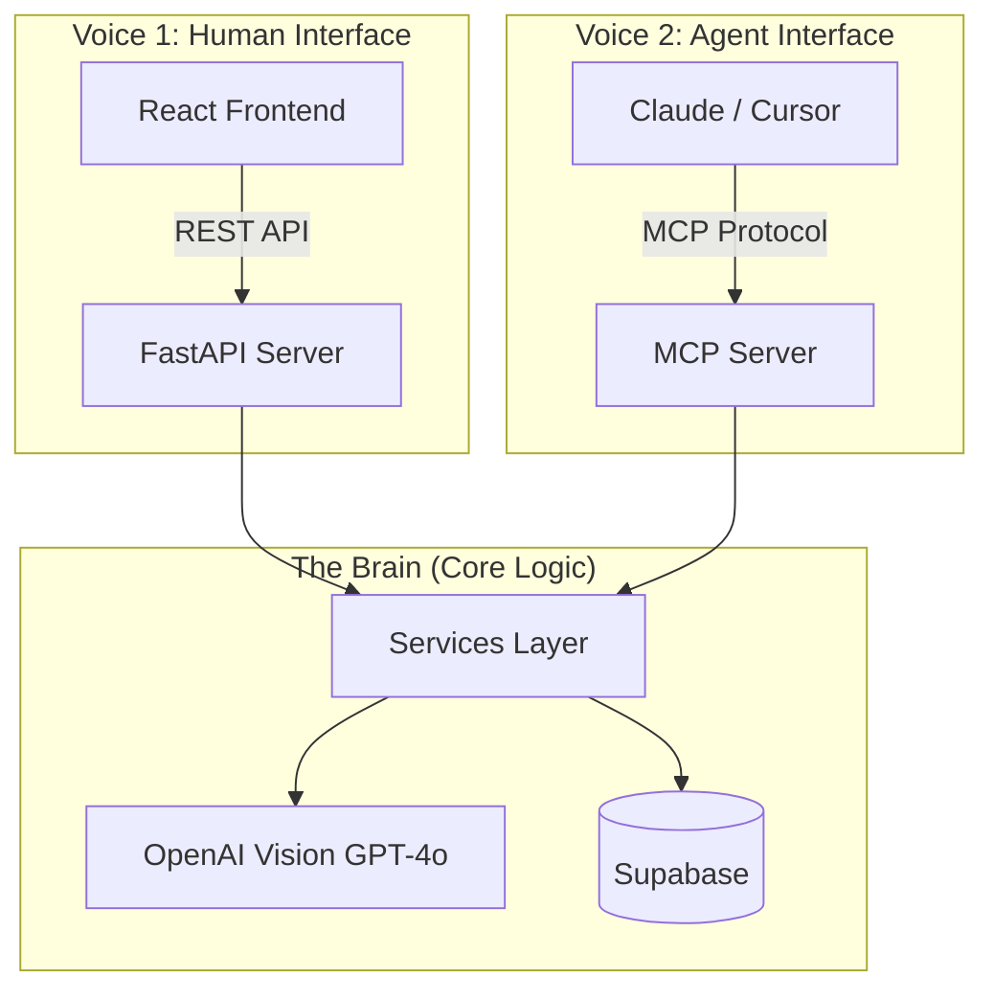

# Personal Vault: Agentic Medical Compliance Microservice

<div align="center">
  <h3>One Brain, Two Voices.</h3>
  <p>A hybrid microservice architecture bridging the gap between human interfaces and AI agents.</p>
</div>

---

## 🧠 The Problem

In a globalized world, medical records are fragmented, unstandardized, and often in different languages. Verifying compliance for schools, travel, or jobs is a manual, error-prone process.

**Personal Vault** solves this by creating a "Universal Translator" for medical compliance. It ingests raw documents, extracts data using Vision AI, and standardizes it against rigorous health protocols (CDC, NHS, Cornell Tech).

## 🏗 Architecture: "One Brain, Two Voices"

This project demonstrates a novel **Agentic Architecture** pattern. Instead of building separate backends for the frontend app and AI agents, we build a single core logic layer ("The Brain") and expose it through two distinct interfaces ("Voices").



### Voice 1: The Human Interface (REST)
- **Consumer**: React Frontend (Humans)
- **Protocol**: HTTP / REST
- **Design**: Rich, visual, interactive. Handles file uploads, progress bars, and visual verification.
- **Tech**: FastAPI, React, Tailwind v4, Framer Motion.

### Voice 2: The Agent Interface (MCP)
- **Consumer**: AI Agents (Claude Desktop, Cursor, IDEs)
- **Protocol**: Model Context Protocol (MCP)
- **Design**: Token-efficient, deterministic, stateless.
- **Tech**: FastMCP, Pydantic, Agent-Optimized Schemas.

---

## 🛠 Technology Stack

### Backend (The Brain)
- **Language**: Python 3.11+
- **Framework**: FastAPI (REST) + FastMCP (Agent Protocol)
- **AI Model**: OpenAI GPT-4o (Vision & Reasoning)
- **Database**: Supabase (PostgreSQL + Storage)
- **Validation**: Pydantic (Strict Schema Enforcement)

### Frontend (The Face)
- **Framework**: React + Vite
- **Styling**: Tailwind CSS v4 (Glassmorphism Design System)
- **Animation**: Framer Motion (60fps transitions)
- **Icons**: Lucide React

---

## 🤖 Agentic Design Patterns

This project implements best practices for building **Agent-Native Tools**:

1.  **Token-Optimized Responses**:
    *   *Bad*: Returning a 5MB raw JSON dump.
    *   *Good*: Returning a flat `AgentComplianceResponse` with `is_compliant` bool and `missing_vaccines` list.
    *   *Why*: Saves context window, reduces hallucination risk.

2.  **Machine-Readable Errors**:
    *   Errors return structured codes (`IMAGE_NOT_FOUND`, `DOWNLOAD_ERROR`) and "Suggestions" for the agent (e.g., "Try searching for a different image URL").
    *   Allows the agent to self-heal and retry strategies.

3.  **Stateless Atomicity**:
    *   Each tool call (`verify_vaccine_record`) is self-contained. The agent doesn't need to "remember" previous steps, making long-running workflows robust.

4.  **Semantic Typing**:
    *   Uses `Enum` (e.g., `VaccineName.MMR`) to ground AI outputs in strict code constants, preventing "fuzzy" string matching issues.

---

## 🚀 Getting Started

### Prerequisites
- Python 3.11+
- Node.js 18+
- OpenAI API Key
- Supabase Project Credentials

### 1. Backend Setup
```bash
cd backend
python -m venv venv
source venv/bin/activate
pip install -r requirements.txt

# Configure Environment
cp .env.example .env
# Add your OPENAI_API_KEY, SUPABASE_URL, SUPABASE_KEY
```

### 2. Run Voice 1 (REST API)
For the React App:
```bash
uvicorn main:app --reload --port 8000
```

### 3. Run Voice 2 (MCP Server)
For AI Agents (Claude/Cursor):
```bash
python mcp_server.py
```
*Note: Configure your MCP client (e.g., Claude Desktop config) to point to this script.*

### 4. Run Frontend
```bash
cd frontend
npm install
npm run dev
```

---

## 🧪 Testing & Verification

We include a specialized test script to verify the **Agent Voice** behaves as expected (simulating an LLM tool call):

```bash
# Run in Mock Mode (No API Cost)
export MOCK_AI=true
python backend/tests/test_agent_voice.py
```

---

## 🔮 Future Roadmap

- [ ] **Wearable Integration**: Ingest Apple Health / Fitbit data for real-time vitals.
- [ ] **RAG Knowledge Base**: Add a "Medical Policy" vector store so agents can query *why* a record is non-compliant.
- [ ] **Multi-Modal Output**: Allow the agent to generate PDF certificates of compliance.

---

<div align="center">
  <p>Built with ❤️ by Vallab Karanam</p>
  <p><i>Demonstrating the future of Agentic Engineering</i></p>
</div>
